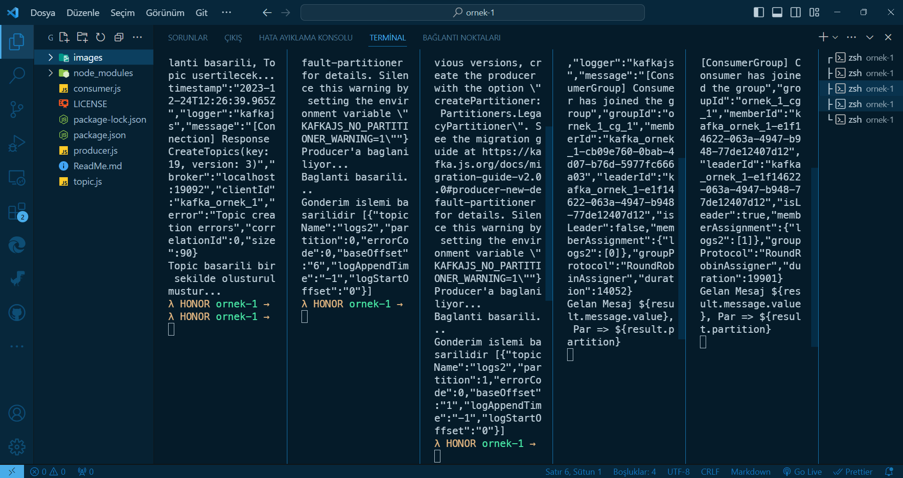

# `NodeJs & Apache Kafka`

<div align="center">
    
</div>

- A simple Apache Kafka example with Node.js

<br>

### This project uses the following packages:

[](https://nodejs.org/)

[](https://kafka.apache.org/)

<br>

### Usage

```bsh
node topic.js
```

```bsh
node consumer.js logs2 0
```

```bsh
node producer.js logs2 0
```

<br>

# License

This project is licensed under the MIT License. See the [LICENSE](LICENSE) file for details

Created by [Mehmet Furkan KAYA](https://www.linkedin.com/in/mehmet-furkan-kaya/)
